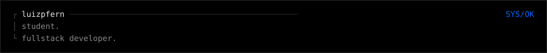
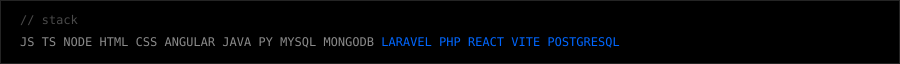

## Hello, I'm Luiz!

I’m a Computer Science student from Ribeirão Preto/SP, Brazil, currently in my 8th semester at UNIP (Universidade Paulista).

I'm currently working as a Full-Stack Developer, where I use Laravel (PHP), React (Vite), PostgreSQL, and other technologies to develop and maintain web applications. Previously, I worked with Node.js (REST API Backend), SQL Server, Angular (Ionic Framework - TypeScript, HTML and CSS/SCSS), MongoDB, Redis, Swagger, and more to develop web and backend applications. These experiences have strengthened my skills in building applications, designing REST APIs, managing databases, and integrating systems.

During my academic journey, I’ve worked on various projects using technologies proposed by the university, such as Java for building object-oriented desktop applications and Python with Keras and TensorFlow for neural network-based image classification. In parallel, my internship has provided valuable real-world experience in managing databases and developing web applications. I’ve worked with APIs, including the integration of third-party services such as postal data lookup (Correios), invoice generation, route calculation, and OpenAI-based solutions. Additionally, I’ve integrated e-commerce platforms like Shopee, Tray, and Mercado Livre using their APIs and real-time webhook systems. These experiences have deepened my understanding of system integration, API design, asynchronous communication, and data-driven application architecture.

 

<table width="100%">
  <tr>
    <td width="49%" valign="top"></td>
    <td width="2%"></td>
    <td width="49%" valign="top"></td>
  </tr>
  <tr><td colspan="3" height="12"></td></tr>
  <tr>
    <td colspan="3"></td>
  </tr>
  <tr><td colspan="3" height="12"></td></tr>
  <tr>
    <td colspan="3"></td>
  </tr>
  <tr><td colspan="3" height="12"></td></tr>
  <tr>
    <td width="49%" valign="top"></td>
    <td width="2%"></td>
    <td width="49%" valign="top"></td>
  </tr>
</table>

